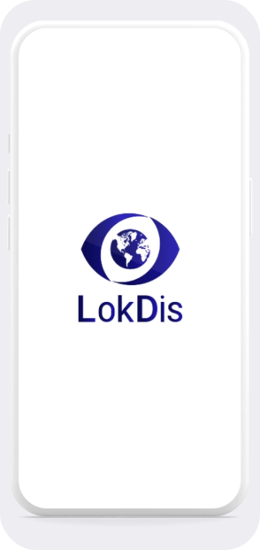

# 🌍 LokDis - Request & Share Real-Time Photos and Videos

<div align="center">
  
  <br>
  <h3>Experience reality from anywhere, without filters</h3>
</div>

<p align="center">
  <a href="#features">Features</a> •
  <a href="#demo">Live Demo</a> •
  <a href="#tech-stack">Tech Stack</a> •
  <a href="#installation">Installation</a> •
  <a href="#usage">Usage</a> •
  <a href="#internationalization">Internationalization</a> •
  <a href="#responsive-design">Responsive Design</a> •
  <a href="#contributing">Contributing</a> •
  <a href="#license">License</a>
</p>

## 📱 Overview

LokDis is a revolutionary platform that allows users to request and share real-time photos and videos from around the world. The application bridges the gap between curiosity and reality, enabling you to see real-world locations through the eyes of someone who's actually there.

## ✨ Features

- **Real-time Requests**: Ask for photos or videos from specific locations worldwide
- **Unfiltered Reality**: See places as they truly are, without edits or filters
- **Versatile Use Cases**:
  - Check beach crowdedness before visiting
  - Verify parking availability in real-time
  - Fact-check information from social media
  - Experience live events from anywhere
- **User-friendly Interface**: Intuitive design that's accessible across all devices
- **Multi-language Support**: Currently available in English and Spanish

## 🔗 Demo

Check out our [live demo](https://lokdis.com) to experience LokDis in action.

## 🛠️ Tech Stack

- **Frontend**:
  - React.js
  - CSS3 with modern features
  - Responsive design principles
- **Internationalization**:
  - Custom i18n implementation
  - Multi-language support
- **Design & UX**:
  - Mobile-first approach
  - Optimized for all screen sizes

## 📦 Installation

1. Clone the repository:
   ```bash
   git clone https://github.com/yourusername/lokdis-launch-page.git
   cd lokdis-launch-page
   ```

2. Install dependencies:
   ```bash
   npm install
   ```

3. Start the development server:
   ```bash
   npm start
   ```

The application will be running at `http://localhost:3000`.

## 🚀 Usage

Once installed, the application provides a landing page showcasing LokDis's features and benefits. Users can:

- View information about the platform
- Read real user testimonials
- Access download links for mobile applications
- Switch between languages
- Contact the team through various channels

## 🌐 Internationalization

LokDis supports multiple languages through a custom internationalization system:

```javascript
// Switch languages easily
const { t, toggleLanguage } = useLanguage();

// Use translations anywhere in your components
<h1>{t('heroTitle')}</h1>
```

Currently supported languages:
- 🇪🇸 Spanish (Default)
- 🇺🇸 English

## 📱 Responsive Design

LokDis is designed to provide an optimal viewing experience across a wide range of devices:

- **Desktop**: Full-featured experience with optimized spacing
- **Tablet**: Adapted layout to maintain usability and aesthetics
- **Mobile**: Mobile-first approach ensuring great UX on small screens
- **Landscape Mode**: Special optimizations for mobile devices in landscape orientation

## 👥 Contributing

We welcome contributions to improve LokDis! Please follow these steps:

1. Fork the repository
2. Create your feature branch: `git checkout -b feature/amazing-feature`
3. Commit your changes: `git commit -m 'Add some amazing feature'`
4. Push to the branch: `git push origin feature/amazing-feature`
5. Open a Pull Request

## 📄 License

This project is licensed under the MIT License - see the LICENSE file for details.

## 📬 Contact

For any questions or suggestions, please reach out to us at:

- Email: [info@lokdis.com](mailto:info@lokdis.com)
- Twitter: [@LokDisApp](https://twitter.com/LokDisApp)

---

<div align="center">
  <p>Made with ❤️ by the LokDis Team</p>
  <p>© 2024 LokDis. All Rights Reserved.</p>
</div>
